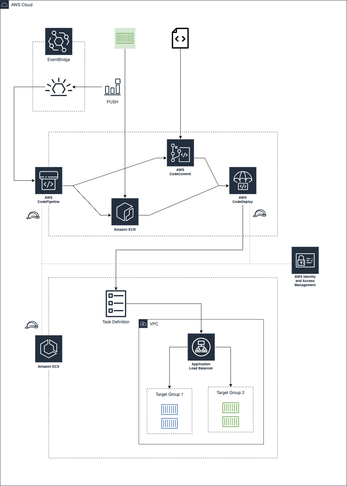

# lab-blue-green-ecs

## Overview
Blue green deployment is an application release model that gradually transfers user traffic from a previous version of an app or microservice to a nearly identical new release—both of which are running in production. 

The old version can be called the blue environment while the new version can be known as the green environment. Once production traffic is fully transferred from blue to green, blue can standby in case of rollback or pulled from production and updated to become the template upon which the next update is made.

## Traffic shift
There are three ways traffic can shift during a blue/green deployment:

- [ ] **Canary**: Traffic is shifted in two increments. You can choose from predefined canary options that specify the percentage of traffic shifted to your updated task set in the first increment and the interval, in minutes, before the remaining traffic is shifted in the second increment.

- [ ] **Linear**: Traffic is shifted in equal increments with an equal number of minutes between each increment. You can choose from predefined linear options that specify the percentage of traffic shifted in each increment and the number of minutes between each increment.

- [ ] **All-at-once**: All traffic is shifted from the original task set to the updated task set all at once.

## solution diagram
Blue green deployment for AWS ECS

